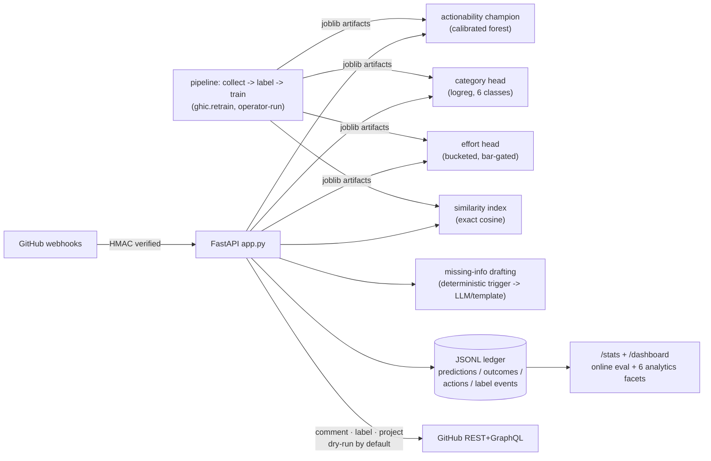
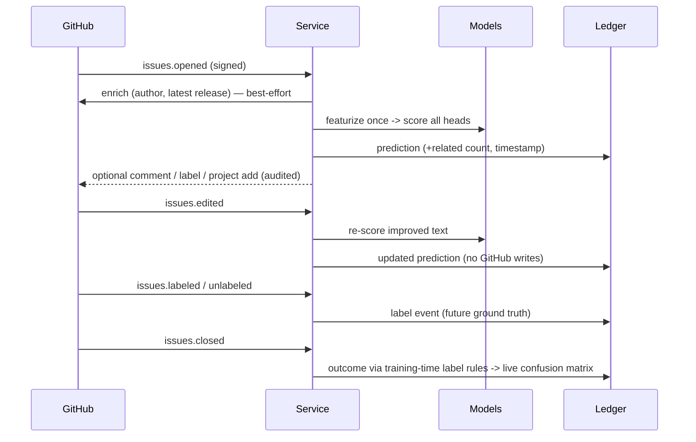

# GHIC — Product Requirements & Roadmap

This document separates what the product **is** (built, tested, measured)
from what it **could become** (designed, explicitly not implemented). Every
capability below is tagged **[BUILT]** or **[DESIGN — planned, not
implemented]**, and every number is a measured result from this repository —
nothing is projected or invented.

## 1. Product vision

GHIC triages newly opened GitHub issues the way a good maintainer would in
the first thirty seconds: estimate whether the report will lead to a real
fix, spot likely duplicates, and ask for missing information — then get out
of the way. It is an assistive signal with calibrated confidence, never an
auto-close mechanism. The design center is a single maintainer or small team
installing a GitHub App; everything heavier is roadmap, gated on usage
signals stated below.

## 2. System architecture [BUILT]

A deliberate **modular monolith**: one Python package, one FastAPI process,
one Docker image.

```
ghic/                    ML pipeline (collect -> label -> features -> train)
ghic/backtest.py         replay evaluation + threshold calibration
ghic/dupdetect.py        duplicate detection: index build, query, evaluation
ghic/category.py         issue category head (train, card, serving)
ghic/effort.py           effort/time-to-close head (ship-bar gated)
ghic/assign.py           assignment recommender (collection + evaluation)
ghic/retrain.py          one-command retraining + run registry
ghic/cli.py              the unified `ghic` CLI
ghic/service/            the deployable webhook service
  app.py                 routes, middleware, event handling
  inference.py           model loading + single-issue prediction
  github_app.py          GitHub App auth (JWT -> installation token) + REST/GraphQL
  tracking.py            prediction ledger / online eval / audit / analytics
  drafting.py            scoped LLM comment drafting (never the decision)
  settings.py            GHIC_* env config, safe defaults
```



Event flow per webhook:



State lives in two places only: model artifacts (`models/*.joblib`, built by
the pipeline) and the append-only JSONL ledger (`data/predictions.jsonl`).
The service holds no other state and restarts cleanly.

### Why not microservices [DESIGN — deliberately rejected for now]

A split earns its complexity when components have **independent scaling
needs, independent failure domains, or independent teams**. Today: one
operator, one traffic source (GitHub webhooks), and every component scales
with the same variable (issues/minute). The measured bottleneck is model
inference CPU (see §8), which a monolith scales by adding workers —
splitting inference into a "model service" would add a network hop and a
serialization format to solve a problem `--workers 4` solves. The seams are
already clean (inference, tracking, drafting are separate modules with typed
interfaces), so a future split is a deployment change, not a rewrite.
Trigger to revisit: sustained traffic where inference saturates a multi-worker
host, or a second consumer of predictions besides the webhook.

## 3. GitHub App architecture [BUILT]

- **Auth**: App JWT (RS256, PyJWT) → per-installation access token, cached
  with early refresh (`github_app.py`). Webhooks verified with
  `X-Hub-Signature-256` HMAC, constant-time compare; unsigned requests
  rejected unless an explicit dev flag is set.
- **Minimum permissions** (a Marketplace review criterion): Issues
  read/write — read to receive events and enrich, write to comment/label;
  Metadata read — implicit baseline. Nothing else: no code, no PRs, no
  members. Event subscription: `issues` only.
- **Event flow**: `issues.opened` → enrich (author profile, latest release)
  → featurize → score (actionability + category + effort) → optional
  duplicate lookup → optional missing-info draft → optional
  comment/label/project-add. `issues.edited` → re-score (never re-post).
  `issues.labeled`/`unlabeled` → ledger (future ground truth).
  `issues.closed` → derive outcome via the training-time labeling rules →
  grade the earlier prediction.
- **Checks API — deliberately absent**: check runs attach to a commit
  `head_sha`; issues have none. Showing issue predictions on unrelated
  commits would be misleading UX bought with an extra write permission.
  Revisit only if the product ever scores pull requests.
- **Projects v2** (opt-in, `GHIC_PROJECT_ID`): predicted-actionable issues
  are added to a board via GraphQL; requires the Projects write permission
  only when enabled.
- **Failure posture**: enrichment, duplicate lookup, and drafting are all
  best-effort — any failure degrades (imputed features, no candidates,
  template text) and never blocks the prediction. Write actions are
  dry-run-by-default.

## 4. ML pipeline & model lifecycle [BUILT]

Documented fully in the README and `models/MODEL_CARD.md`; summary of the
lifecycle: collect (idempotent, cached GraphQL) → label (deterministic rules
+ audit histogram) → train (`--champion`: walk-forward temporal CV over four
candidates → isotonic calibration → single test-set evaluation →
auto-generated model card) → backtest (full held-out replay through the real
webhook + per-repo threshold calibration) → serve (champion auto-preferred)
→ online evaluation (live precision/recall from close events). Retraining is
one command — `python -m ghic.retrain` — which re-runs label → champion →
backtest → category → duplicate index, snapshots every card/metric file to
`reports/runs/<timestamp>/`, and appends a row (winner, headline metrics,
artifact sha256) to `models/REGISTRY.md`. That registry-plus-snapshots
answers what heavier MLOps tooling answers — what changed, when, what did
it score — with zero infrastructure; an experiment-tracking server is
unjustified at one model family and one operator.

### 4b. Prediction heads beyond actionability [BUILT / honestly absent]

| head | status | evidence |
|---|---|---|
| Category (bug/feature/question/docs/duplicate/invalid) | **BUILT** — assistive suggestion, never auto-labeled | `models/CATEGORY_CARD.md`: macro-F1 0.470, full confusion matrix |
| Effort (coarse time-to-resolution bucket) | **BUILT** — cleared a pre-declared ship bar; API response only | `models/EFFORT_CARD.md`: Spearman 0.492, MAE −11.8% vs baseline |
| Priority | **not shipped** — zero ground truth in corpus | `models/PRIORITY_CARD.md` |
| Severity | **not shipped** — only a circular keyword proxy exists | `models/SEVERITY_CARD.md` |
| Maintainer assignment | **BUILT** — similarity recommender beat the most-active baseline; response-only, never assigns | `models/ASSIGNMENT_CARD.md`: hit@3 0.389 vs 0.261 (n=968) |

## 5. Duplicate detection [BUILT — with a negative validation result]

Embedding/TF-IDF nearest-neighbor over prior same-repo issues; exact cosine
search (at ~6k issues a normalized matrix product is milliseconds — a vector
database is unjustified complexity; `DupIndex.query` is the seam where an
ANN index would slot in at 100× the corpus). The causal evaluation
(`models/DUPLICATE_CARD.md`) produced a **negative result worth more than a
working demo**: max similarity to prior issues is near chance at predicting
duplicate-labeled closure (ROC ≈ 0.52–0.56, PR-AUC ≈ 0.06 vs 7.3% base
rate), and MiniLM embeddings do not beat the TF-IDF baseline. Mechanism: at
vscode's volume almost every issue has a similar prior issue; duplicate
*closure* is triager behavior, not a text property. Consequences applied:
candidate surfacing ships as assistive context only ("possibly related —
verify"), no automatic duplicate flag exists, and the roadmap item this
motivates is collecting pairwise duplicate-target ground truth
(issue-to-issue timeline references) before any stronger claim. A first
slice of that data now accumulates for free: the service records every
maintainer label event (including timestamped duplicate labels) to the
ledger as it happens.

## 6. LLM-assisted triage & RAG [BUILT — scoped]

The generative model is confined to what generation is good at:

- **Missing-information drafting** (`drafting.py`): a deterministic,
  tested trigger (≥2 concrete gaps: no repro keywords, no code block/trace,
  very short body) decides *whether* to ask; Claude drafts *how* to ask,
  grounded with similar prior issues from the duplicate index (the RAG
  scope: comment-grounding and duplicate surfacing — not a chat layer).
  Off by default (`GHIC_DRAFT_MISSING_INFO`); degrades to a deterministic
  template without an API key or on any API error.
- **The actionability decision is never delegated** to the LLM. That
  decision comes from the calibrated classifier whose trustworthiness the
  entire evaluation protocol establishes.

## 7. Observability & audit [BUILT]

- Structured one-line JSON log per request (method, path, status, ms).
- `/stats` (token-gated): totals, positive rate, live-graded confusion
  matrix, per-endpoint latency percentiles (p50/p95/p99 over a rolling 1k
  samples), 5xx count, last 20 predictions, and the six-facet analytics
  block (below).
- `/dashboard`: self-contained read-only HTML over `/stats`, rendering all
  six facets from real ledger data: issue trends (predictions/day),
  duplicate rate (share of predictions with similar-prior candidates +
  duplicate labels observed live), resolution analytics, confidence
  histogram (P deciles), label stats (maintainer-applied, observed live),
  and per-repo component analytics. Facets a deploy hasn't earned data for
  show zeros — never placeholders.
- **Audit trail**: every GitHub write (comment/label) is appended to the
  ledger as a who/what/when record (`type: "action"`); the bot is the only
  writer, so actor identity is implicit. Restart-safe; count surfaced in
  `/stats`.

## 8. Performance — measured, not projected [BUILT]

Load test of the running service (`scripts/loadtest.py`, single uvicorn
worker, Windows dev machine, calibrated champion model, 2026-07-13;
`reports/loadtest.json`):

| Scenario | Throughput | p50 | p95 | p99 |
|---|---|---|---|---|
| 30 requests, concurrency 1 | 1.68 req/s | 596 ms | 626 ms | 637 ms |
| 200 requests, concurrency 8 | 1.65 req/s | 4,811 ms | 5,309 ms | 5,875 ms |

The honest reading: **one prediction costs ~600 ms of CPU** (char+word
TF-IDF transform + 300-tree calibrated forest), and a single worker
serializes concurrent requests — throughput is flat at ~1.7 req/s while
queueing inflates latency linearly with concurrency. Consequences:

- A busy repo opens well under one issue per second; a single worker is
  comfortably sufficient for the intended deployment, and stays inside
  GitHub's 10 s webhook deadline at any plausible per-repo rate.
- The scaling lever, in order: `uvicorn --workers N` (inference is
  stateless; the ledger is append-only per process — move it per §9 first),
  then horizontal replicas behind GitHub's webhook retry semantics.
- Cheap latency wins if ever needed: fewer trees, smaller TF-IDF vocab —
  both would be validated through the champion protocol, not assumed.

## 9. Ledger storage: JSONL now, SQLite when [BUILT / DESIGN]

The ledger is append-only JSONL, replayed on startup. Schema (one JSON
object per line):

| record | fields |
|---|---|
| `prediction` | repo, number, proba, predicted |
| `outcome` | repo, number, truth |
| `action` | repo, number, action (comment/label), detail, at |

**Why JSONL is currently correct**: single writer, append-only, human
inspectable, survives restarts, and replay of years of predictions is
milliseconds at this write rate. **The concrete triggers for SQLite** (the
next step — not Postgres): (a) multiple uvicorn workers, because concurrent
appends from separate processes interleave unsafely; (b) startup replay
exceeding ~1s (≈ millions of lines); (c) queries beyond "replay everything"
(per-repo dashboards, time windows). The SQLite schema is the table-per-
record-type transliteration of the JSONL fields with an index on
`(repo, number)` — *planned, not implemented*.

## 10. Roadmap [DESIGN — planned, not implemented]

Each item names the usage signal that would trigger building it.

- **Multi-tenancy & RBAC.** Today's real tenant boundary is GitHub's own
  installation model: each installation's data flows only back to its own
  repos, and per-repo thresholds provide per-tenant tuning. A control-plane
  version — per-installation config store (thresholds, action toggles),
  a settings UI behind GitHub OAuth, per-tenant ledgers — becomes worth
  building when unrelated third parties install the app and ask for
  differing configuration. Not before: a config table with one row is RBAC
  cosplay.
- **Kubernetes at scale.** The service is stateless-except-ledger, ships a
  health probe, and is already containerized — the K8s path is a Deployment
  with an HPA on CPU, the ledger moved to a managed store (per §9), and
  model artifacts pulled from object storage at boot. Trigger: sustained
  multi-instance load, i.e. thousands of installations. Docker (+ compose)
  is the supported deployment until then.
- **Enterprise analytics suite, SSO, compliance certifications.** Explicitly
  out of scope for a single-operator open-source app. The existing audit
  ledger and PRIVACY.md are the honest current story; SOC 2 et al. exist
  only when a paying enterprise customer exists.
- **Billing / paid Marketplace plan.** Start free (see DEPLOYMENT.md
  checklist); billing webhooks and plan gating are built only after real
  installations justify publisher verification.

## 11. Testing strategy [BUILT]

155 tests: every labeling rule branch, feature transforms, collection
paging/backoff (mocked network), webhook signature/routing/actions
(opened/edited/closed/label events, Projects v2 paths), per-repo
thresholds, online evaluation and ledger persistence, duplicate surfacing
(including index-failure isolation), category derivation + suggestion
isolation, effort buckets + comment-exclusion, assignment recommender on a
synthetic two-cluster corpus, retraining registry/snapshot mechanics, all
six dashboard facets (including rebuild-from-ledger and legacy-line
tolerance), the unified CLI (delegation + real end-to-end predict/explain),
drafting trigger + template fallback, latency stats, OpenAPI export, and an
end-to-end smoke test against the real trained model. Model claims are
validated by the champion protocol and the service-path backtest rather
than unit tests. The load test (§8) is run manually against a live
instance; CI runs lint + tests + a Docker build on every push.
